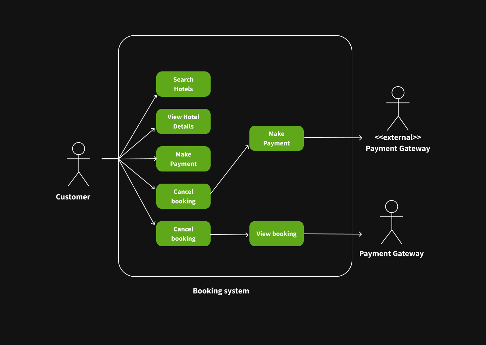

# Requirement Analysis in Software Development

## Introduction

This repository is dedicated to exploring the requirement analysis phase in the software development lifecycle. It provides a structured approach to documenting, analyzing, and organizing software requirements, forming the foundation for successful project planning and implementation.

Through a simulated real-world case study, this project aims to enhance understanding of:
- Requirements gathering techniques
- Functional and non-functional requirement documentation
- Use case modeling
- Requirement validation and management

The goal is to demonstrate best practices and methodologies that ensure clarity, completeness, and alignment with stakeholder expectations.

## What is Requirement Analysis?

Requirement Analysis is a critical phase in the Software Development Life Cycle (SDLC) that involves gathering, evaluating, and documenting the needs and expectations of stakeholders for a software system. The primary goal is to ensure that the final product aligns with user requirements and business objectives before any design or coding begins.

This process typically includes:
- **Requirement Elicitation:** Engaging with stakeholders through interviews, surveys, or workshops to gather information.
- **Requirement Analysis:** Structuring, prioritizing, and resolving conflicts among collected requirements.
- **Requirement Specification:** Documenting requirements in a clear, concise, and unambiguous format, often in Software Requirement Specification (SRS) documents.
- **Requirement Validation:** Ensuring requirements are complete, feasible, and verifiable.

### Importance in the SDLC

Requirement Analysis lays the foundation for the entire software development process. Its importance includes:
- **Reduces development errors and rework** by clarifying expectations upfront.
- **Improves communication** among clients, designers, and developers through a shared understanding.
- **Enables better planning** of time, budget, and resources.
- **Supports quality assurance** by providing criteria against which the final product can be tested.

Neglecting proper requirement analysis often leads to scope creep, project delays, increased costs, and user dissatisfaction. A thorough analysis ensures the right problem is being solved and sets the stage for successful software development.

## Why is Requirement Analysis Important?

Requirement Analysis plays a foundational role in ensuring the success of any software project. It serves as the blueprint for the design, development, and testing phases. Here are three key reasons why it is critical in the Software Development Life Cycle (SDLC):

### 1. Clear Understanding of Project Scope

By thoroughly analyzing and documenting requirements, development teams and stakeholders gain a shared understanding of what the software is supposed to do. This clarity helps prevent scope creep, ensures alignment with business objectives, and sets realistic expectations from the beginning.

### 2. Improved Planning and Estimation

With well-defined requirements, teams can more accurately estimate the time, cost, and resources needed for the project. It allows project managers to create more reliable schedules and budgets, reducing the likelihood of delays and cost overruns.

### 3. Enhanced Product Quality and User Satisfaction

When software is built according to well-analyzed and validated requirements, it is more likely to meet user needs and perform reliably. This leads to fewer changes during development, fewer bugs, and higher user satisfaction upon release.

Requirement Analysis ultimately helps minimize risks, improves collaboration, and lays a strong foundation for a successful, user-centered software product.

## Key Activities in Requirement Analysis

The Requirement Analysis phase consists of several critical activities that ensure software requirements are accurate, complete, and aligned with stakeholder needs. Below are the five key activities involved:

- **Requirement Gathering**  
  This is the initial step where information is collected from stakeholders, users, and subject matter experts. It involves understanding the high-level needs, business goals, and pain points that the software must address.

- **Requirement Elicitation**  
  Elicitation goes beyond simple collection by engaging with stakeholders using interviews, surveys, workshops, brainstorming sessions, and observation techniques. The goal is to uncover both stated and unstated requirements.

- **Requirement Documentation**  
  After collecting and clarifying requirements, they are formally documented in a structured format such as a Software Requirements Specification (SRS) document. This documentation serves as a reference point for design, development, and testing.

- **Requirement Analysis and Modeling**  
  In this phase, requirements are analyzed for consistency, feasibility, and completeness. Models such as use case diagrams, user stories, flowcharts, or data models may be created to visually represent the system behavior and interactions.

- **Requirement Validation**  
  The final step ensures that the documented requirements accurately reflect the needs of stakeholders. Validation techniques include reviews, walkthroughs, and prototyping. This step helps catch issues early before moving into design and development.

Each of these activities plays a vital role in reducing misunderstandings, improving product quality, and aligning the final solution with user and business needs.

## Types of Requirements

In software engineering, requirements are typically categorized into two main types: **Functional Requirements** and **Non-functional Requirements**. Both are essential to ensure that the software system works as intended and meets quality standards.

### Functional Requirements

Functional requirements describe the specific behaviors, features, and functions that the system must perform. These define **what** the system should do.

#### Examples for a Booking Management System:
- Users shall be able to create, view, edit, and cancel bookings.
- The system shall send confirmation emails to users after a successful booking.
- Administrators shall be able to manage user accounts and booking records.
- The system shall validate booking time slots to avoid double bookings.
- Users shall be able to search available time slots using filters (e.g., date, service type).

### Non-functional Requirements

Non-functional requirements specify the **quality attributes** of the system, such as performance, usability, reliability, and security. These define **how** the system should perform.

#### Examples for a Booking Management System:
- The system shall respond to user requests within 2 seconds under normal load.
- The system shall be available 99.9% of the time (uptime).
- All user data shall be encrypted in transit and at rest.
- The user interface shall be mobile-responsive and accessible via screen readers.
- The system shall support up to 10,000 concurrent users.

Understanding and documenting both functional and non-functional requirements is essential to delivering a complete and effective software solution.

## Use Case Diagrams

### What are Use Case Diagrams?

Use Case Diagrams are a type of behavioral diagram defined by UML (Unified Modeling Language). They help capture the functional requirements of a system from the end user's perspective. Each diagram represents a set of actions (use cases) that actors (users or external systems) can perform.

### Benefits of Use Case Diagrams:

- Provide a clear picture of system functionality
- Help identify all types of users (actors)
- Assist in requirement validation with stakeholders
- Facilitate communication between technical and non-technical teams

---

### 📌 Booking System – Use Case Diagram

The following diagram illustrates the main actors and use cases for the hotel booking system.

## Acceptance Criteria

### What are Acceptance Criteria?

Acceptance Criteria are a set of predefined requirements that must be met for a feature or user story to be considered complete and accepted by stakeholders. They define the boundaries of a user story and ensure the development team understands exactly what needs to be built.

### Importance in Requirement Analysis

- ✅ Clarify expectations between stakeholders and developers
- ✅ Reduce ambiguity in requirements
- ✅ Guide test case development and validation
- ✅ Ensure feature completeness and usability
- ✅ Improve communication among cross-functional teams

---

### Example: Checkout Feature – Acceptance Criteria

**User Story**:  
_As a customer, I want to securely complete the payment for my hotel booking so that I can confirm my reservation._

**Acceptance Criteria:**

1. ✅ **Payment Gateway Integration**: The system must integrate with a third-party payment gateway to handle transactions.
2. ✅ **Payment Methods**: The customer must be able to pay using credit/debit card or digital wallet.
3. ✅ **Secure Transaction**: All payment data must be encrypted using SSL/TLS.
4. ✅ **Validation**: The system must validate all payment fields (e.g., card number, CVV, expiry date).
5. ✅ **Booking Confirmation**: Upon successful payment, a booking confirmation email and message must be sent to the customer.
6. ✅ **Transaction Failure Handling**: If payment fails, the system should provide an appropriate error message and allow retry.
7. ✅ **Booking Locking**: The booking slot must be temporarily locked during the checkout to prevent double booking.
8. ✅ **Payment Logging**: The transaction must be logged for auditing purposes.

---

By clearly defining acceptance criteria, we ensure that both business goals and user needs are satisfied, and we create a shared understanding across the team.

